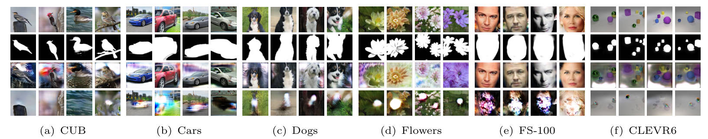
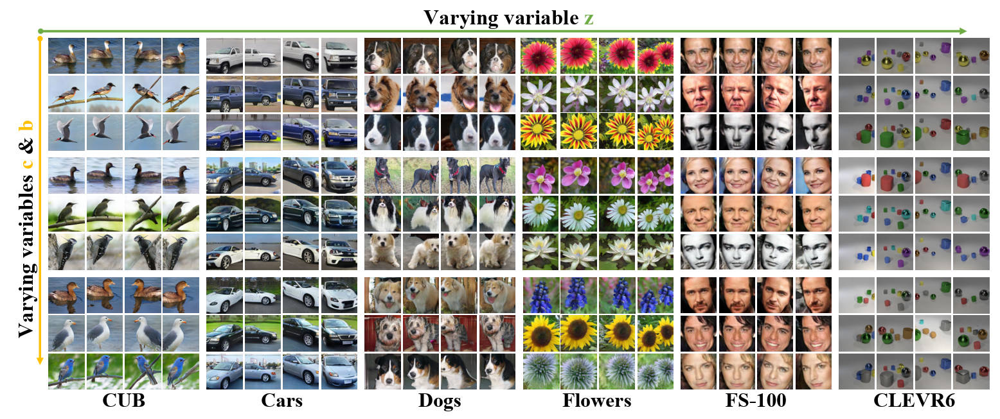
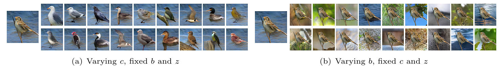
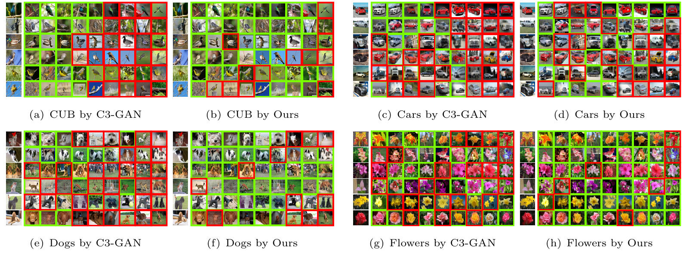
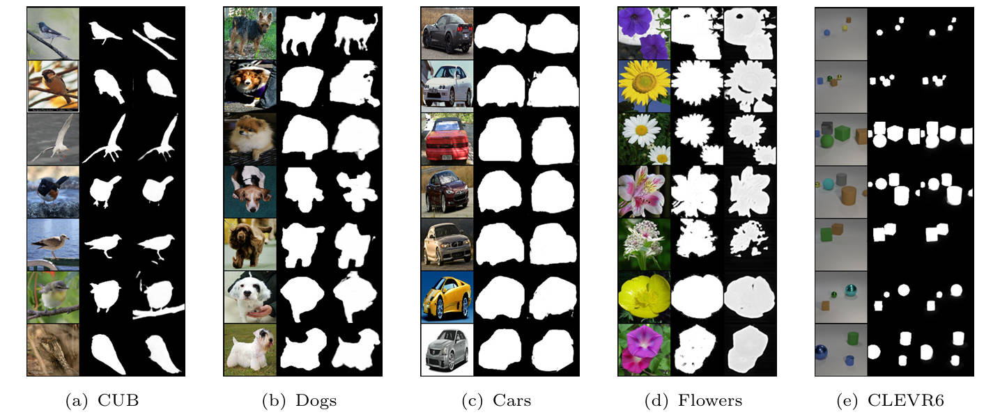

# L2IC

This is the official code of our paper "Learning to Image Composition for Disentanglement, Clustering and Segmentation"

------

### Requirements

- Linux
- Python 3.8
- Pytorch 1.10.2
- Torchvision 0.11.3
- NVIDIA GPU + CUDA CuDNN

### Dataset

**Note**: You need to download the data if you wish to train your own model.

Download [CUB](http://www.vision.caltech.edu/datasets/), [Stanford Cars](https://paperswithcode.com/dataset/stanford-cars), [Stanford Dogs](http://vision.stanford.edu/aditya86/ImageNetDogs/), [Oxford Flower](https://www.robots.ox.ac.uk/~vgg/data/flowers/102/), [FS100](https://openaccess.thecvf.com/content_CVPR_2019/html/Wu_Enhancing_TripleGAN_for_Semi-Supervised_Conditional_Instance_Synthesis_and_Classification_CVPR_2019_paper.html), and [CLEVR](https://cs.stanford.edu/people/jcjohns/clevr/) datasets. Please extract them inside the `data` directory.
For segmentation task, we use the `CUB`, `Dog`,  `Car`, and `Clevr` datasets provided by [DRC](https://github.com/yuPeiyu98/Deep-Region-Competition). You can refer to DRC for details.

### Testing

##### **※ Pretrained model**

Download trained models that have the same extracted code `l2ic`. Please extract them inside the [saved_models]() directory 

```shell
cd saved_models
unzip birds.zip
cd ..
```

>  FS100 and CLEVR are not involved in the clustering task, so cfg.OVER is not applicable.

|    Dataset    | cfg.FINE_GRAINED_CATEGORIES | cfg.OVER |                         Parameters                          |
| :-----------: | :-------------------------: | :------: | :---------------------------------------------------------: |
|      CUB      |             600             |    3     | [Download](https://pan.baidu.com/s/1bQim6MeoU16sy3jdRio1Ug) |
| Stanford Cars |             588             |    3     | [Download](https://pan.baidu.com/s/1R68dz20bJVMitlOco0LWUg) |
| Stanford Dogs |             360             |    3     | [Download](https://pan.baidu.com/s/1csamTY74ba1Xfu6wVvBjJQ) |
| Oxford Flower |             306             |    3     | [Download](https://pan.baidu.com/s/1HmaRpJaLRfQmjWbLX-1biQ) |
|     FS100     |             300             |    \     | [Download](https://pan.baidu.com/s/1kAXTyUIzzsJagN8ygjPI1w) |
|    CLEVR6     |             60              |    \     | [Download](https://pan.baidu.com/s/1iVviImNDOc7dlqN4HR_IBA) |

##### **※ Evaluating the model**

>  The disentanglement and clustering modules

- Specify the output directory to save the results in `SAVR_DIR`

In [config.py]()

- Specify the data path in `DATA_DIR`.
- Turn on the evaluation in `TRAIN.FLAG`

In [train_DC_module.py]()

- Specify the generator and the discriminator paths in `G` and `D`.

- Execute the following code.

  ```shell
  python train_DC_module.py SAVE_DIR
  ```

  

> The segmentation module

- Specify the output directory to save the results in `SAVR_DIR`
- Turn on the evaluation in `TRAIN.FLAG`

In [cub_split.yml]()

- Specify the data path in `ROOT_DIR`. 

In [train_Seg_module.py]()

- Specify the segmentation network path in `U`.

- Execute the following code.

  ```shell
  python train_DC_module.py SAVE_DIR
  ```

------

### III. Results

> ##### ※ Image disentanglement
>
> The foreground, background, and mask are excellently decomposed without clever regularization or supervision.

<p align="center">
  </img>
</p>

 


> ##### ※ Controlled image generation 
>
> We use $z$, $c$, and $b$ to control the generated image's pose, category, and background.  Class semantics is well disentangled.  Varying $c$ changes both the shape and texture of objects.

<p align="center">
  </img>
</p>
<p align="center">
  </img>
</p>

 


> ##### ※  Fine-grained clustering
>
> Compared to the current SOTA approach (i.e., C3-GAN), our method obtains more correct results (green boxes), especially on CUB and Flowers datasets.

<p align="center">
  </img>
</p>


> ##### ※ Unsupervised Segmentation
>
> Our method predicts finer segmentation masks with a simple network even when facing single-object and multi-object scenarios.

<p align="center">
  </img>
</p>


------

### Acknowledgment

We thank the following authors for releasing their source code, data, and models:

- [FineGAN: Unsupervised Hierarchical Disentanglement for Fine-Grained Object Generation and Discovery](https://arxiv.org/abs/1811.11155).

- [Contrastive Fine-grained Class Clustering via Generative Adversarial Networks](https://arxiv.org/abs/2112.14971).
- [Unsupervised Foreground Extraction via Deep Region Competition](https://arxiv.org/abs/2110.15497#).
